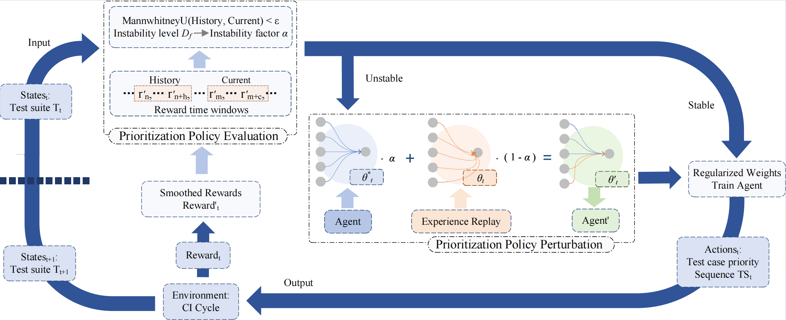

## CRL-TCP: Continual Reinforcement Learning-based Test Case Prioritization

This project contains the experimental code and datasets for CRL-TCP, a test case prioritization technique based on continual reinforcement learning.

CRL-TCP detects instability through continuous evaluation of the non-stationary CI environment to guide the agent's retraining process, effectively alleviating the forgetting problem caused by retraining.

The experimental framework diagram of our project is shown below:


### Directory Structure

- `SparseRewardExplanation`: The explanation for the sparse reward problem.
- `src`: Source code for CRL-TCP.
- `dataset.zip`: Preprocessed dataset used for the experiment.
- `CRLTCP-Framework.png`: Method framework diagram for CRL-TCP.

### Requirements

Development environment:

```
Python: 3.10.9
PyTorch: V2.2.0
OS: Ubuntu 20.04.6 LTS
```

Third-party dependencies:

```
numpy: 1.23.5
pandas: 1.5.3
scipy: 1.10.0
openpyxl: 3.0.10
```

### Execution

Run.py is the main entry file. You can run the CRL-TCP method using `python Run.py`. During execution, a **CRL-TCP.log** file will be generated, and the execution results will be stored in the **results** folder at the same level as the src directory. You can use `python Statistic.py` to analyze the execution results, and the statistical results will be saved in **CRL-TCP.xlsx**.
