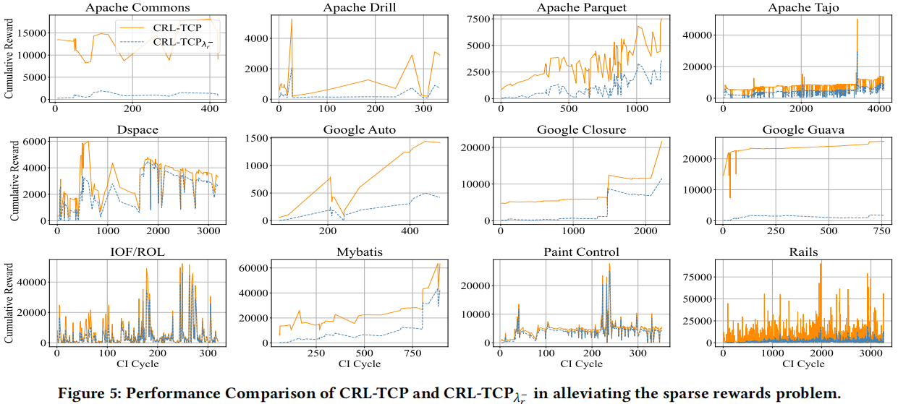
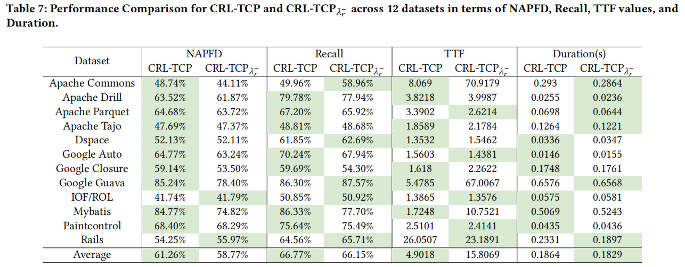

## This document aims to explain how the CRL-TCP method accurately addresses the problem of sparse rewards.

>The CRL-TCP method smooths the reward values and applies the reward regularization policy proposed in this paper. This approach effectively mitigates the problem of sparse rewards, improves the performance of test case prioritization, and encourages the agent's exploratory behavior.

Our evaluation of the sparse reward problem is based on previous studies. Specifically, we assess the issue from two perspectives: changes in **cumulative reward** values and **final ranking quality**. 

It is important to note that research on cumulative reward values is derived from the reinforcement learning field. Higher cumulative reward values indicate that the agent has made more correct choices, implying a broader range of behavioral options.

Additionally, the assessment of final ranking quality employs commonly used metrics in the TCP domain: NAPFD, Recall, TTF, and Duration. The first three metrics are used to evaluate the performance of the methods, while the last metric assesses the time overhead. For these metrics, higher values for the first two and lower values for the last two are preferable.

### Cumulative reward

As illustrated in the figure, the yellow line represents our proposed CRL-TCP method, while the blue line represents method CRL-TCPλr-, which does not address the sparse reward problem. The x-axis represents CI cycles, and the y-axis represents the cumulative reward value obtained in each CI cycle. The figure clearly shows that the cumulative reward value of the CRL-TCP method consistently exceeds that of method CRL-TCPλr-. Additionally, the cumulative reward value for the CRL-TCP method demonstrates a continuous upward trend as the CI cycles increase. This indicates that the CRL-TCP method not only assists the agent in making correct decisions but also effectively mitigates the sparse rewards problem by encouraging exploratory behavior.

### Final ranking quality

The performance of the CRL-TCP method and method CRL-TCPλr- in prioritizing test cases across 12 datasets is shown in the table above, with the optimal values for different metrics highlighted. As indicated in the table, the overall quality of the prioritization decreased when the reward regularization policy was removed. This change is mainly reflected in the NAPFD 、Recall and TTF metrics. While the decline in the NAPFD and Recall metrics are not significant, the TTF metric shows a marked decrease when the handling of sparse rewards is removed, directly affecting the feedback time of integration testing. Therefore, it can be concluded that the CRL-TCP method effectively addresses the sparse rewards problem, improving the overall prioritization quality and reducing the feedback time in integration testing.

It is noteworthy that the results indicate a complementary relationship between the reward regularization policy and the CRL-TCP method. Their effective combination can further enhance prioritization quality and TCP performance.
